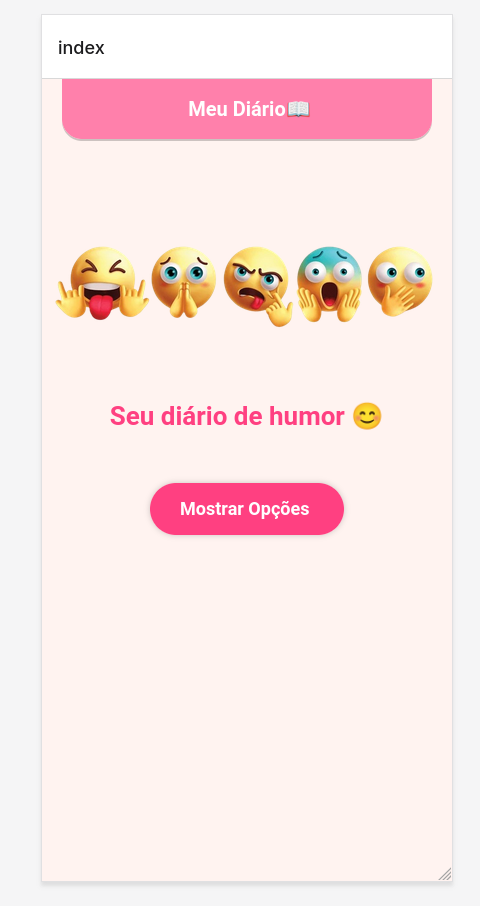
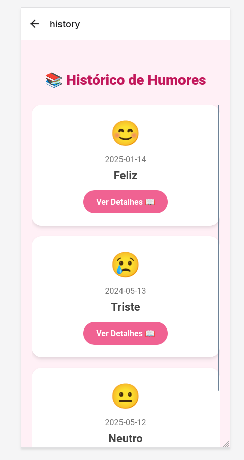
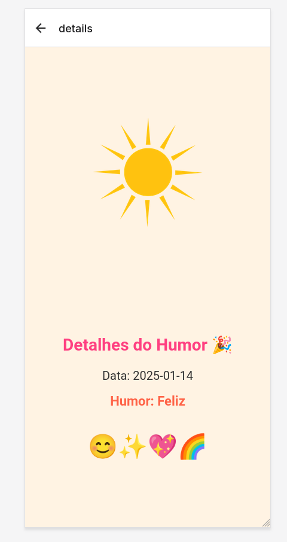
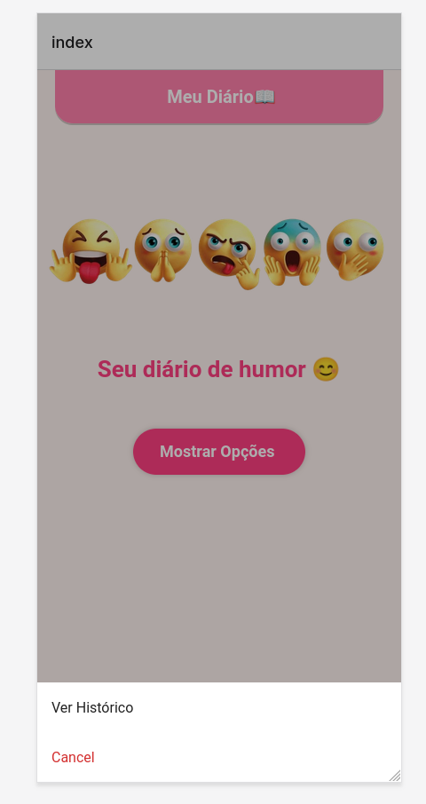

# Meu App de Humor

Este é um aplicativo que permite ao usuário registrar e visualizar seu humor ao longo do tempo. O app exibe um histórico de humores, e o usuário pode visualizar detalhes sobre cada entrada de humor.

## Funcionalidades
- Registrar humor com emoji e data
- Visualizar histórico de humores
- Detalhes sobre cada humor registrado

## Como rodar o projeto

1. Clone o repositório:

   ```bash
   git clone https://github.com/seu-usuario/nome-do-repositorio.git

Instale as dependências:

cd nome-do-repositorio
npm install

Execute o projeto:

npx expo start


## 📸 Screenshots

### Tela Principal


### Histórico de Humores


### Detalhes do Humor


### Action

